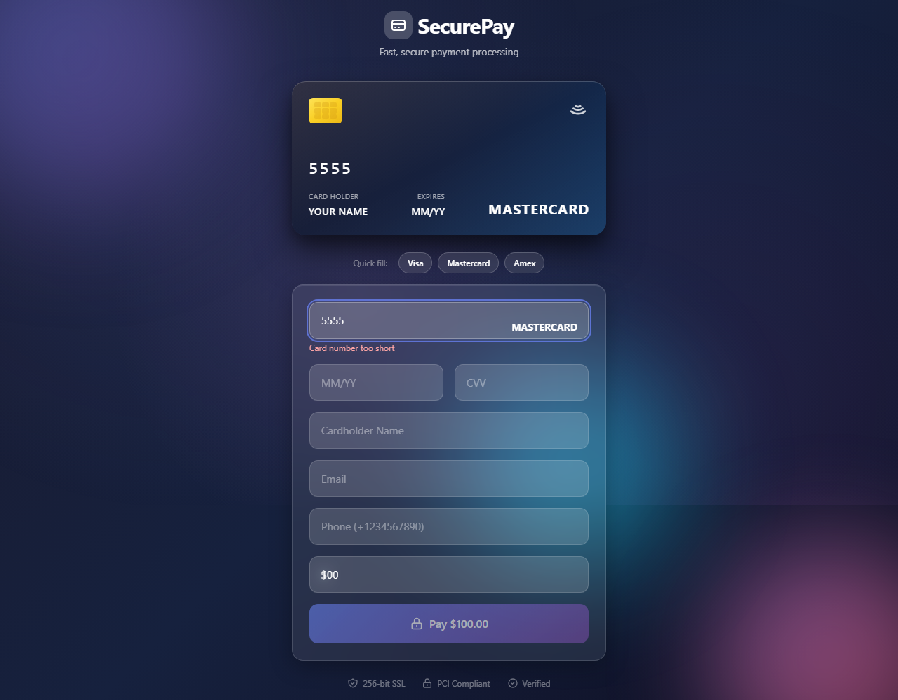
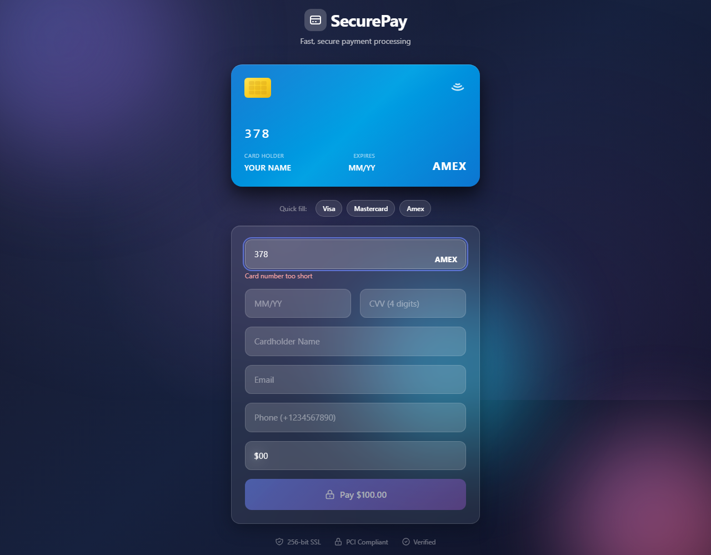
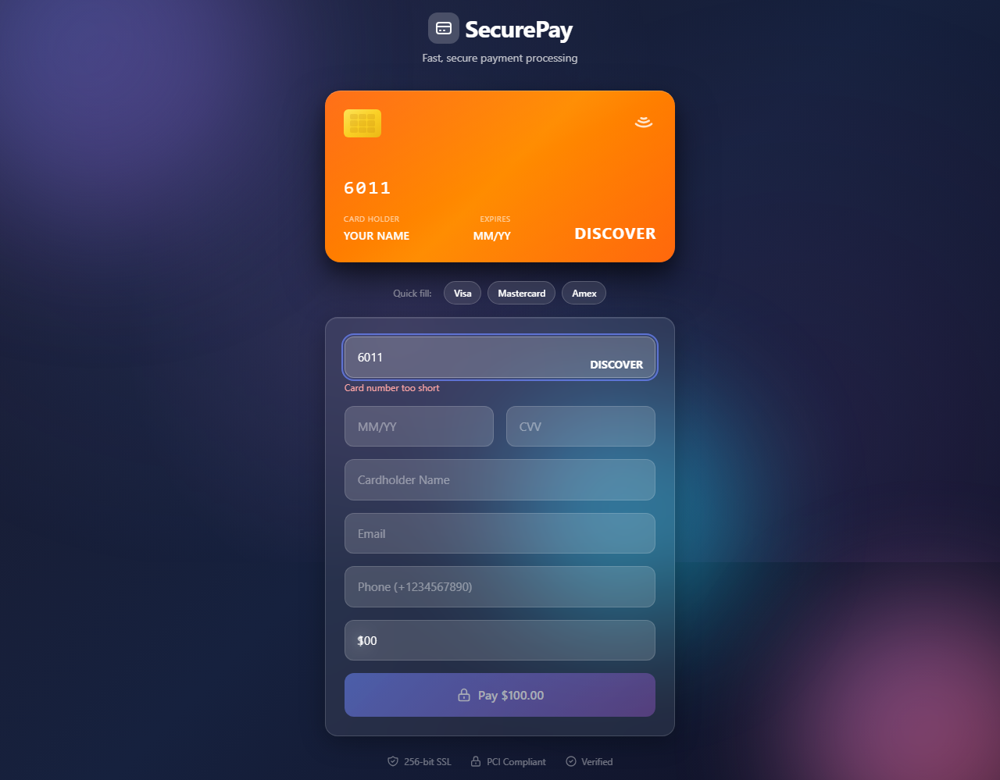
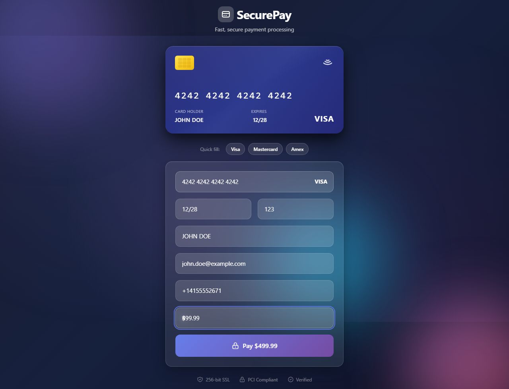
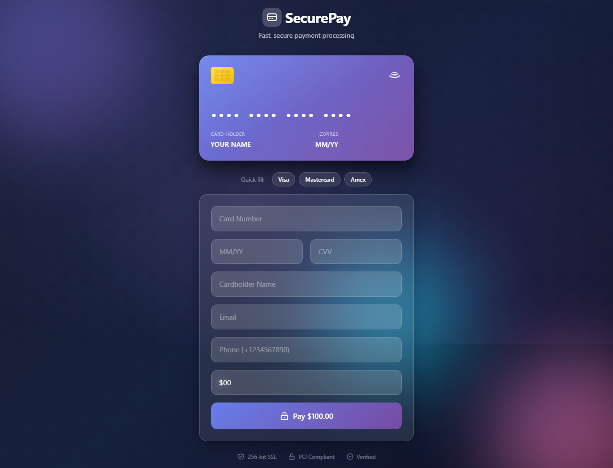
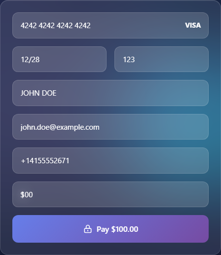

# SecurePay - Premium Payment Gateway Simulator

A production-grade payment gateway simulator demonstrating full-stack development, SRE practices, and payment industry knowledge. Features a modern, polished UI with 3D card animations and real-time validation.

## ✨ Features Highlights

- **🎨 Modern Glassmorphism UI** - Premium design with animated backgrounds and frosted glass effects
- **💳 3D Interactive Card** - Realistic credit card with flip animation for CVV
- **⚡ Real-time Validation** - Luhn algorithm, card detection, and inline error feedback
- **🔒 Security Focused** - PCI-compliant design with trust indicators
- **📱 Fully Responsive** - Optimized for desktop, tablet, and mobile

---

## 📸 Visual Demonstration

### Landing Page
Modern payment form featuring animated gradient backgrounds with floating orbs, glassmorphism UI, and an interactive 3D credit card display.


### Card Network Selection
One-click test cards with instant brand-specific styling and colors:

#### Visa Card
The card updates with Visa's signature blue gradient and brand logo.


#### Mastercard
Premium dark gradient with Mastercard branding.


#### American Express
Distinctive blue styling for Amex with 4-digit CVV support.


### 3D Card Flip Animation
Focus on the CVV field to see the realistic card flip animation, revealing the back with magnetic stripe and CVV area.

| Card Front | Card Back (CVV Focus) |
|:----------:|:---------------------:|
|  |  |

### Form Completion Flow
Step-by-step demonstration of the form with real-time validation and formatting:

| Card Number | Expiry & CVV | Complete Form |
|:-----------:|:------------:|:-------------:|
|  |  |  |

### Smart Card Detection
Automatic card network detection as you type, with instant visual feedback:

| Visa (4...) | Mastercard (5...) | Amex (37...) | Discover (6011...) |
|:-----------:|:-----------------:|:------------:|:------------------:|
|  |  |  |  |

### Custom Payment Amount
Enter any amount with real-time button updates:



### Responsive Design
Optimized layouts for all device sizes:

| Desktop (1280px) | Tablet (768px) | Mobile (375px) |
|:----------------:|:--------------:|:--------------:|
|  |  |  |

### Security Trust Indicators
Professional security badges to build user confidence:



### Glassmorphism Form Component
Modern frosted glass design with semi-transparent inputs:



---

## 🌐 Service URLs

| Service | URL | Credentials | Description |
|---------|-----|-------------|-------------|
| **Frontend** | http://localhost:3000 | N/A | SecurePay payment interface |
| **Backend API** | http://localhost:5000 | token + client headers | RESTful APIs |
| **API Docs** | http://localhost:5000/api-docs | N/A | Swagger UI |
| **Metrics** | http://localhost:5000/metrics | N/A | Prometheus metrics |
| **Mongo Express** | http://localhost:8081 | admin / admin123 | Database UI |
| **MongoDB** | localhost:27017 | admin / admin123 | Database |

## 🚀 Quick Start

```bash
# Start all services
docker compose up --build

# Run tests
cd backend && npm test

# Access frontend
open http://localhost:3000
```

## 💳 Features

### Payment Gateway
- Transaction processing with fraud detection
- Risk scoring engine (0-100 scale)
- Analytics APIs (overview, time-series, card-types)
- Webhook system with HMAC-SHA256 signatures
- Transaction management (process, list, view, refund)

### Frontend - SecurePay UI
- **Next.js 14** with TypeScript
- **3D Card Visualization** with flip animation
- **Glassmorphism Design** with animated backgrounds
- **Real-time Validation** using Luhn algorithm
- **8 Card Networks** supported with auto-detection
- **Responsive** design for all devices

### Backend
- Express with MongoDB
- Fraud detection engine
- Prometheus metrics
- Swagger/OpenAPI documentation
- Comprehensive test suite

### SRE & Observability
- Prometheus metrics at `/metrics`
- Swagger documentation at `/api-docs`
- Health checks
- Security headers (Helmet)
- Rate limiting

## 🧪 Test Cards

| Network | Card Number | CVV |
|---------|-------------|-----|
| **Visa** | 4242 4242 4242 4242 | 123 |
| **Mastercard** | 5555 5555 5555 4444 | 123 |
| **Amex** | 3782 8224 6310 005 | 1234 |

## 🛠️ Technology Stack

- **Frontend**: Next.js 14, TypeScript, Tailwind CSS
- **Backend**: Node.js, Express, MongoDB, Mongoose
- **Infrastructure**: Docker, Docker Compose
- **Observability**: Prometheus, Swagger/OpenAPI
- **Testing**: Jest (40+ tests), Playwright E2E (13 tests)

## ✅ Testing

### Unit Tests
```bash
cd backend
npm test
```

### E2E Tests (Playwright)
```bash
# Start the application first
docker compose up -d

# Run E2E tests
cd e2e
npm install
npx playwright install chromium
npx playwright test

# View test report
npx playwright show-report
```

All 13 E2E tests pass, capturing screenshots of the complete user journey.

## 📁 Project Structure

```
card-validation-api/
├── backend/           # Express API server
│   ├── src/
│   │   ├── api/      # API routes and controllers
│   │   ├── config/   # Configuration
│   │   └── middleware/
│   └── tests/
├── frontend/          # Next.js 14 SecurePay UI
│   └── src/
│       └── app/      # App router pages
├── e2e/              # Playwright E2E tests
│   ├── tests/        # Test specifications
│   └── screenshots/  # Auto-captured screenshots
├── docs/
│   └── screenshots/  # Documentation screenshots
└── docker-compose.yml
```

## 📜 License

MIT License - see [LICENSE](LICENSE) for details.
